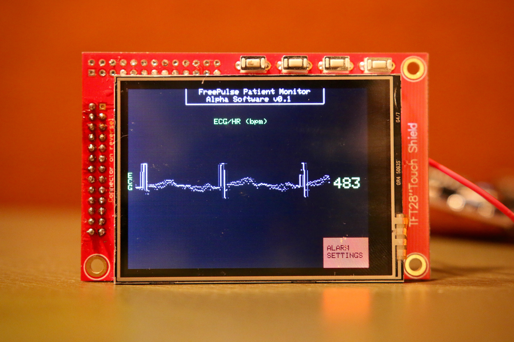

# FreePulse Patient Monitor

***THIS REPO IS DEPRECATED***

Significant hardware changes merited a fresh start with the code. Check out the new repo [here][newrepo]

Introducing FreePulse, a low-cost patient monitor designed for developing world hospitals.

Check out the project website [here][sitelink]!

Features
--------
- 3-lead ECG, SpO2, and NIBP monitoring
- 6 hour battery life and uninterrupted power supply
- Touch screen interface
- Portable design
- Sturdy plastic enclosure

Accolades
--------
1st place, Engineering World Health National Design Competition
2nd place, National Institute of Health DEBUT Competition

[sitelink]: http://www.freepulsemed.com
[newrepo]: https://www.github.com/ReeceStevens/freepulse
